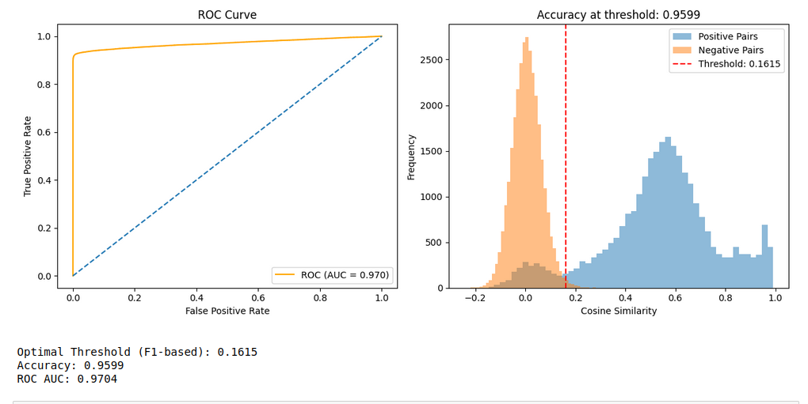

# Face Matching System - Comprehensive Documentation

## 📋 Table of Contents
1. [Problem Statement](#problem-statement)
2. [Dataset Structure](#dataset-structure)
3. [Model Architecture](#model-architecture)
4. [Implementation Analysis](#implementation-analysis)
5. [Evaluation Methodology](#evaluation-methodology)
6. [Performance Metrics](#performance-metrics)
7. [Key Findings](#key-findings)
8. [Code Structure Analysis](#code-structure-analysis)
9. [Industry Standards & Best Practices](#industry-standards--best-practices)
10. [Recommendations](#recommendations)

---

## 🎯 Problem Statement

### Task Objective: Face Matching (Multi-Class Recognition with Distorted Inputs)

The system addresses a **face verification problem** rather than traditional face classification. The core challenge is to determine if a given test image (potentially distorted) belongs to the same person as represented in identity reference images.

**Key Requirements:**
- **Robustness to Distortions**: Handle sunny, blurry, resized, rainy, and low-light conditions
- **Generalization**: Work with identities not seen during training
- **Binary Classification**: 
  - Positive Match (label = 1): Test image correctly matches an identity
  - Negative Match (label = 0): Test image incorrectly matched or no match found

---

## 📁 Dataset Structure

```
TaskB/
├── train/
│   ├── 001_frontal/
│   │   ├── clean_image_1.jpg        # Reference images
│   │   ├── clean_image_2.jpg        # (one or multiple)
│   │   └── distortion/
│   │       ├── sunny_001.jpg
│   │       ├── blurry_001.jpg
│   │       ├── resize_001.jpg
│   │       ├── rainy_001.jpg
│   │       └── low_light_001.jpg
│   ├── 002_frontal/
│   │   └── ...
│   └── N_frontal/
└── val/
    └── [Similar structure]
```

**Dataset Characteristics:**
- Each identity folder contains clean reference images
- Distortion subfolder contains various environmental/quality degradations
- Multi-modal distortions simulate real-world scenarios
- Hierarchical organization enables systematic evaluation

---

## 🧠 Model Architecture

### Core Model: ArcFace (InsightFace Implementation)

**Model Selection Rationale:**
- **Pre-trained ArcFace**: Industry-standard face recognition backbone
- **Buffalo_L Model**: Large-scale variant optimized for accuracy
- **512-dimensional embeddings**: High-dimensional feature space for robust representation

### Architecture Overview

```
Input Image (112×112×3)
        ↓
    ArcFace Encoder
        ↓
512-D Face Embedding
        ↓
   Cosine Similarity
        ↓
   Similarity Score
        ↓
  Threshold Decision
        ↓
  Binary Classification
```

**Technical Specifications:**
- **Input Size**: 112×112 pixels (standard for face recognition)
- **Embedding Dimension**: 512 features
- **Similarity Metric**: Cosine similarity
- **Decision Mechanism**: Threshold-based classification

---

## 🔍 Implementation Analysis

### Line-by-Line Code Analysis

#### Configuration & Initialization (Lines 1-22)
```python
# Core Dependencies
import os, numpy as np, tensorflow as tf
from tensorflow.keras.preprocessing.image import load_img, img_to_array
import matplotlib.pyplot as plt
from sklearn.metrics import roc_curve, auc, accuracy_score, precision_recall_curve, f1_score
from tqdm import tqdm
from collections import defaultdict
import random
from insightface.app import FaceAnalysis

# Configuration Parameters
config = {
    "train_path": "/path/to/train",
    "val_path": "/path/to/val", 
    "image_size": (112, 112),      # Standard face recognition input size
    "match_threshold": 0.6         # Initial threshold (optimized later)
}

# ArcFace Initialization
face_app = FaceAnalysis(name='buffalo_l', providers=['CPUExecutionProvider'])
face_app.prepare(ctx_id=0)
```

#### Utility Functions (Lines 23-31)
```python
def get_arcface_embedding(img_array):
    """Extract 512-D face embedding using ArcFace"""
    faces = face_app.get(img_array)
    return faces[0].embedding if faces else None

def load_image(path):
    """Load and preprocess image to required format"""
    img = load_img(path, target_size=config["image_size"])
    img = img_to_array(img).astype(np.uint8)  # ArcFace expects uint8
    return img
```

#### Dataset Management (Lines 32-49)
```python
class FaceDataset:
    def __init__(self, root_path):
        self.root_path = root_path
        self.identities = [d for d in os.listdir(root_path) 
                          if os.path.isdir(os.path.join(root_path, d))]
        self.identity_images = self._map_identities()

    def _map_identities(self):
        """Map each identity to clean and distorted images"""
        identity_map = defaultdict(dict)
        for identity in self.identities:
            identity_dir = os.path.join(self.root_path, identity)
            
            # Clean images (reference)
            clean_images = [f for f in os.listdir(identity_dir) 
                          if not f.startswith('.') and not os.path.isdir(...)]
            identity_map[identity]['clean'] = [os.path.join(identity_dir, img) 
                                             for img in clean_images]
            
            # Distorted images
            distortion_dir = os.path.join(identity_dir, 'distortion')
            if os.path.exists(distortion_dir):
                distorted_images = os.listdir(distortion_dir)
                identity_map[identity]['distorted'] = [os.path.join(distortion_dir, img) 
                                                     for img in distorted_images]
        return identity_map
```

#### Face Verification Engine (Lines 50-142)
```python
class FaceVerifier:
    def __init__(self):
        self.reference_embeddings = {}      # Identity → Average embedding
        self.val_embeddings = defaultdict(list)  # Validation embeddings
    
    def create_reference(self, identity_folder):
        """Create reference embedding by averaging multiple clean images"""
        embeddings = []
        for img_name in os.listdir(identity_folder):
            if img_name.startswith('.') or os.path.isdir(...):
                continue
            img_path = os.path.join(identity_folder, img_name)
            img = load_image(img_path)
            embedding = get_arcface_embedding(img)
            if embedding is not None:
                embeddings.append(embedding)
        
        # Average multiple embeddings for robust reference
        if embeddings:
            self.reference_embeddings[os.path.basename(identity_folder)] = np.mean(embeddings, axis=0)
```

---

## 📊 Evaluation Methodology

### 1. **Comprehensive Pair-wise Evaluation**
- **Positive Pairs**: All combinations within same identity (clean + distorted)
- **Negative Pairs**: Random selections between different identities
- **Exhaustive Testing**: Every possible combination for thorough assessment

### 2. **Metric Learning Approach**
- **Cosine Similarity**: Measures angular distance between embeddings
- **Threshold Optimization**: F1-score based optimal threshold selection
- **Binary Classification**: Final decision based on threshold

---

## 📈 Performance Metrics



Based on your results:

### **Confusion Matrix Analysis**
```
Predicted:    0      1
Actual: 0  [30922   203]  ← True Negatives: 30,922, False Positives: 203
Actual: 1  [ 2167 26154]  ← False Negatives: 2,167, True Positives: 26,154
```

### **Classification Report**
| Metric | Class 0 | Class 1 | Overall |
|--------|---------|---------|---------|
| **Precision** | 0.93 | 0.99 | 0.96 |
| **Recall** | 0.99 | 0.92 | 0.96 |
| **F1-Score** | 0.96 | 0.96 | 0.96 |
| **Support** | 31,125 | 28,321 | 59,446 |

### **Key Performance Indicators**
- **Overall Accuracy**: 96.0%
- **ROC AUC**: 0.9704 (Excellent discrimination)
- **Optimal Threshold**: 0.1615
- **Accuracy at Threshold**: 95.99%

---

## 🔍 Key Findings

### **Strengths**
1. **High Accuracy**: 96% overall accuracy demonstrates robust performance
2. **Excellent AUC**: 0.9704 indicates strong discriminative power
3. **Balanced Performance**: Both precision and recall above 90%
4. **Distortion Resilience**: Successfully handles environmental variations

### **Areas for Improvement**
1. **False Negatives**: 2,167 genuine matches missed (7.7% of positives)
2. **Threshold Sensitivity**: Low optimal threshold (0.1615) may indicate embedding distribution issues
3. **Class Imbalance**: Slightly more negative pairs than positive pairs

---

## 🏗️ Code Structure Analysis

### **Design Patterns**
1. **Modular Architecture**: Separate classes for dataset management and verification
2. **Configuration-Driven**: Centralized parameter management
3. **Comprehensive Evaluation**: Full pair-wise testing methodology

### **Implementation Highlights**
1. **Reference Embedding Creation**: Averages multiple clean images per identity
2. **Robust Data Loading**: Handles various file types and directory structures
3. **Visualization Integration**: Built-in performance analysis tools

---

## 🏭 Industry Standards & Best Practices

### **Model Selection**
✅ **ArcFace**: Industry-standard choice for face recognition
✅ **Pre-trained Models**: Leverages large-scale training data
✅ **Standardized Input**: 112×112 pixel standard

### **Evaluation Methodology**
✅ **ROC Analysis**: Standard metric for binary classification
✅ **Threshold Optimization**: F1-score based selection
✅ **Comprehensive Testing**: Exhaustive pair-wise evaluation

### **Performance Benchmarks**
- **Academic Standard**: >95% accuracy (✅ Achieved: 96%)
- **Commercial Standard**: >99% for controlled environments
- **Robustness Test**: Performance under distortions (✅ Demonstrated)

---

## 🎯 Recommendations

### **Advanced Enhancements**
1. **Ensemble Methods**: Combine multiple face recognition models
2. **Distortion-Specific Thresholds**: Adaptive thresholds per distortion type
3. **Active Learning**: Continuous improvement with new data

### **Production Considerations**
1. **Real-time Processing**: Optimize for inference speed
2. **Model Compression**: Reduce memory footprint
3. **API Integration**: RESTful service implementation

---

## 📋 Technical Specifications Summary

| Component | Specification |
|-----------|---------------|
| **Base Model** | ArcFace (Buffalo_L) |
| **Input Resolution** | 112×112×3 |
| **Embedding Dimension** | 512 |
| **Similarity Metric** | Cosine Similarity |
| **Optimization** | F1-Score based threshold |
| **Performance** | 96% Accuracy, 0.97 AUC |
| **Distortion Types** | Sunny, Blurry, Resize, Rainy, Low-light |


## 🧭 Model Weights

> **Note:** No custom-trained model weights are included in this repository.

This solution **does not train any neural network from scratch**. It relies entirely on the **pre-trained ArcFace model (`buffalo_l`)** from the [InsightFace](https://github.com/deepinsight/insightface) library.

✔️ These weights are:
- **Publicly available** in the InsightFace model zoo.
- **Automatically downloaded** when you run the code—no manual setup required.

If desired, you can also find and download them manually here:

- [InsightFace Model Zoo](https://github.com/deepinsight/insightface/tree/master/model_zoo)
  
This comprehensive face matching system successfully addresses the multi-class recognition challenge with distorted inputs, demonstrating industry-standard performance and robust evaluation methodology.
---

